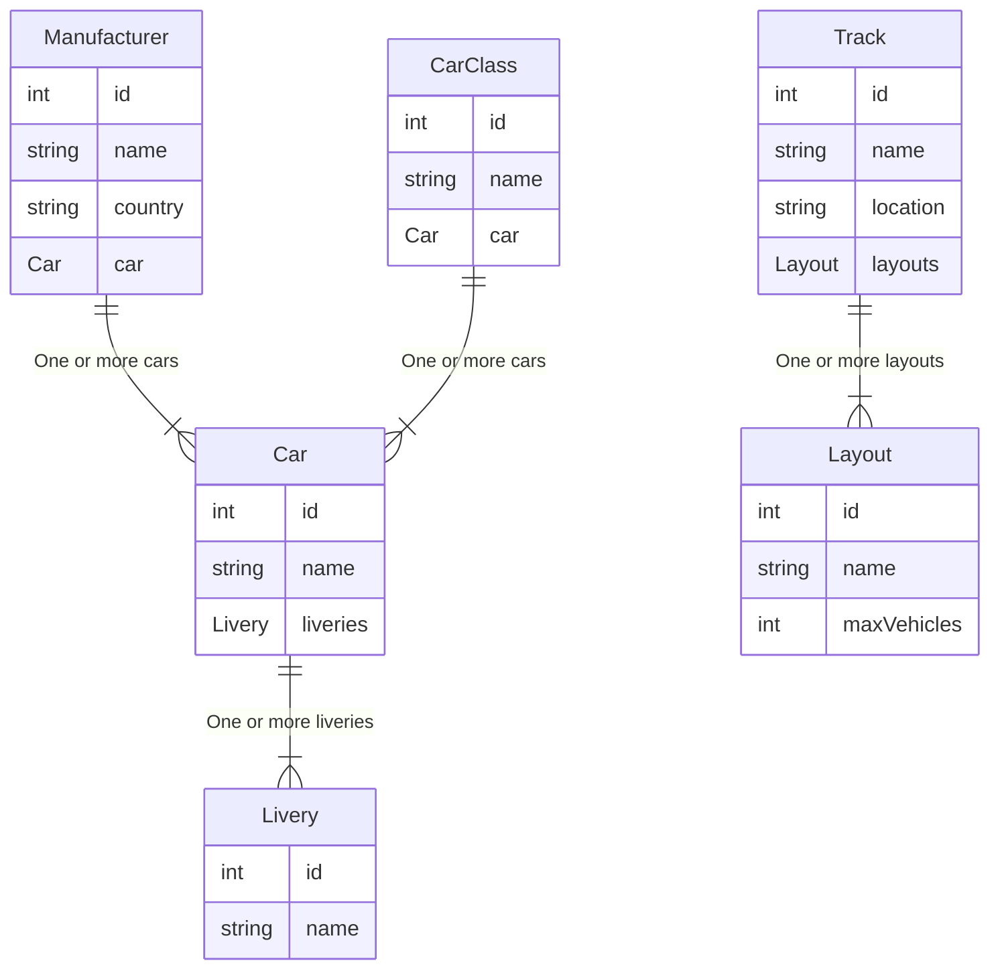

```mermaid
erDiagram
    Car ||--|{ Livery : "One or more liveries"
    Manufacturer ||--|{ Car : "One or more cars"

    CarClass ||--|{ Car : "One or more cars"

    Track ||--|{ Layout : "One or more layouts"

    Livery {
        int id
        string name
    }
    Car {
        int id
        string name
        Livery liveries
    }
    Manufacturer {
        int id
        string name
        string country
        Car car
    }
    CarClass {
        int id
        string name
        Car car
    }

    Layout {
        int id
        string name
        int maxVehicles
    }
    Track {
        int id
        string name
        string location
        Layout layouts
    }

```