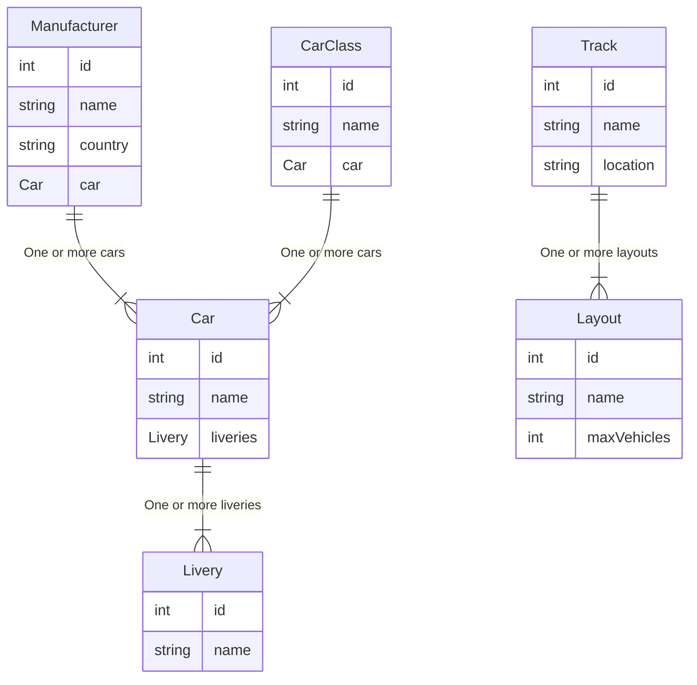

R3E Content


Race stats
```mermaid
erDiagram

    Driver ||--|{ Result : "One or more results"
    Driver ||--|{ Laps : "One or more laps"
    Driver ||--|{ Incident : "One or more incidents"
    Event ||--|{ Session : "One or more sessions"
    Session ||--|{ Result : "One or more results"
    Session ||--|{ Laps : "One or more laps"
    Session ||--|{ Incident : "One or more incidents"
    Car ||--|{ Result : "Used in one or more results"
    Track ||--|{ Event : "Host one or more events"
    Layout ||--|{ Event : "Used in one or more events"
    Driver ||--|{ Incident : "Involved in incidents" 

    Driver {
        int id
        string name
    }
    Event {
        int id
        int trackId FK
        int layoutId FK
        date eventDate
    }
    Session {
        int id
        int eventId FK
        string sessionType
    }
    Result {
        int id
        int driverId FK
        int sessionId FK
        int carId FK
        int startPosition
        int position
        int classStartPosition
        int classPosition
        time totalRaceTime
        string finishStatus
        int totalLaps 
    }
    Laps {
        int id
        int driverId FK
        int sessionId FK
        time lapTime
        time sector1Time
        time sector2Time
        time sector3Time
        bool isValid
    }
    Incident {
        int id
        int driverId FK
        int sessionId FK  
        string incidentType
        int incidentPoints
        int lapNumber
        int involvedDriverId FK 
    }